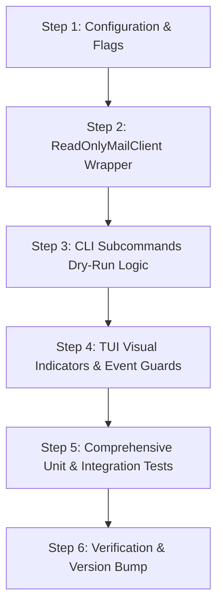

# Read-Only Mode Implementation Plan for `mail_cli`

## 1. Executive Summary & Design Goals

### 1.1 Objective
Provide a robust, multi-layered **Read-Only Mode** across `mail_cli` (both CLI subcommands and TUI interactive mode). This enables users and developers to test new features, run filtering heuristics, inspect real-world inboxes, and execute automated integration tests against live accounts with **zero risk** of mutating server data, deleting emails, or altering unread flags.

### 1.2 Core Safety Invariants
1. **Zero Remote Mutations**: No API request that deletes, moves, sends, or modifies server-side labels or read/unread flags may be dispatched to the remote mail server.
2. **Defense in Depth**: Safety is enforced at the lowest client boundary ([`MailClient`](file:///home/sariel/prog/26/mail_cli/client.go) interface wrapper) as well as the higher orchestration, CLI command, and TUI layers.
3. **Transparent Read/Sync Caching**: Read operations (fetching message bodies, downloading headers, querying folder structures) continue to function normally to keep the application responsive and accurate.
4. **Clear User Feedback**: Any attempted mutation in CLI or TUI mode produces an explicit, unambiguous notice indicating that the action was blocked or simulated.

---

## 2. Configuration & Flag Architecture

### 2.1 Configuration Schema Extensions
Extend the configuration model in [`cfg_g/types.go`](file:///home/sariel/prog/26/mail_cli/cfg_g/types.go) and [`cfg_acc/types.go`](file:///home/sariel/prog/26/mail_cli/cfg_acc/types.go):

```go
// In cfg_acc.AccountConfig (per-account setting in config.json):
type AccountConfig struct {
    // ... existing fields ...
    ReadOnly bool `json:"read_only,omitempty"`
}

// In cfg_g.FileConfig (global setting in config.json):
type FileConfig struct {
    // ... existing fields ...
    ReadOnly *bool `json:"read_only,omitempty"`
}

// In cfg_g.Config (runtime configuration):
type Config struct {
    // ... existing fields ...
    ReadOnly bool
}
```

### 2.2 CLI Flags & Argument Preprocessing
- Add global flags in [`cli/cli.go`](file:///home/sariel/prog/26/mail_cli/cli/cli.go):
  - `--read-only`, `--dry-run`, `-ro`
- Update `preprocessArgs` in [`orchestration.go`](file:///home/sariel/prog/26/mail_cli/orchestration.go):
  - Map `-ro` / `-read-only` / `--dry-run` to `--read-only` flag.
  - Set `config.ReadOnly = true` when flag is detected.

### 2.3 Evaluation Hierarchy (Precedence)
1. **CLI Flag (`--read-only` / `--dry-run`)**: Highest precedence. If set on the command line, enforces read-only mode globally across all selected accounts.
2. **Account Config (`accounts[].read_only`)**: If an account has `"read_only": true`, that account runs in read-only mode even if no CLI flag is passed.
3. **Global Config (`read_only`)**: If set to `true` at the root of `config.json`, defaults all accounts to read-only.

---

## 3. Interface Layer: `ReadOnlyMailClient` Wrapper

Enforcing read-only behavior via the decorator pattern guarantees that even if higher-level code has a bug or omits a check, the network layer cannot execute mutations.

### 3.1 Wrapper Definition (`mailclient/readonly.go`)
Create a new decorator struct implementing [`mailclient.MailClient`](file:///home/sariel/prog/26/mail_cli/mailclient/client.go):

```go
package mailclient

import (
    "errors"
    "log/slog"
    "mail_cli/cfg_g"
    "mail_cli/email"
    "mail_cli/label"
)

var ErrReadOnlyOperationBlocked = errors.New("operation blocked: account is in read-only mode")

type ReadOnlyMailClient struct {
    Delegate MailClient
    AccountName string
}

func NewReadOnlyMailClient(delegate MailClient, accountName string) *ReadOnlyMailClient {
    return &ReadOnlyMailClient{
        Delegate:    delegate,
        AccountName: accountName,
    }
}
```

### 3.2 Method-by-Method Behavior

| Method | Behavior in Read-Only Mode |
|---|---|
| `FetchAndDownloadEmails(folder, query)` | **Pass-through** to `Delegate` (read-only fetch). |
| `GetLabelItems()` | **Pass-through** to `Delegate` (retrieves folder listings). |
| `InboxFolder()` | **Pass-through** to `Delegate`. |
| `Config()` | **Pass-through** to `Delegate`. |
| `Validate()` | **Pass-through** to `Delegate`. |
| `MoveEmail(ids, fromFolder, toFolder)` | **No-op**. Log info `[READ-ONLY] Simulated MoveEmail`, return `nil`. |
| `DeleteMessage(ids)` | **Blocked**. Log warn `[READ-ONLY] DeleteMessage blocked`, return `ErrReadOnlyOperationBlocked`. |
| `ReportSpam(ids, fromFolder)` | **No-op**. Log info `[READ-ONLY] Simulated ReportSpam`, return `nil`. |
| `MarkAsRead(ids)` | **No-op**. Log debug `[READ-ONLY] Simulated MarkAsRead`, return `nil`. |
| `SendEmail(msg)` | **Blocked**. Log warn `[READ-ONLY] SendEmail blocked`, return `ErrReadOnlyOperationBlocked`. |
| `ApplyLabel(ids, label)` | **No-op**. Log info `[READ-ONLY] Simulated ApplyLabel`, return `nil`. |
| `RemoveLabel(ids, label)` | **No-op**. Log info `[READ-ONLY] Simulated RemoveLabel`, return `nil`. |

### 3.3 Integration in Factory (`client.go`)
In [`client.go`](file:///home/sariel/prog/26/mail_cli/client.go):
```go
if localCfg.ReadOnly || acc.ReadOnly {
    client = mailclient.NewReadOnlyMailClient(client, acc.Name)
}
```

---

## 4. Subcommand & CLI Business Logic

### 4.1 `scan` Command
- **Current Behavior**: Moves detected spam or ham to target folders if `-m` or `--inbox-move` flags are passed.
- **Read-Only Behavior**:
  - Displays `[READ-ONLY / DRY RUN]` banner in output.
  - Heuristics run identically and print classification decisions.
  - Skips server moves and outputs: `"[DRY-RUN] Would move %d message(s) to %s\n"`.

### 4.2 `spam` Subcommands
- `spam bye` / `spam mark`:
  - Output simulated report: `"[DRY-RUN] Would mark message %s as spam and move to %s\n"`.
- `spam del`:
  - Terminate immediately with clear error: `"Error: Cannot permanently delete messages while in read-only mode."`

### 4.3 `arc` (Archive) Commands
- `arc all` / `arc <id>`:
  - Output: `"[DRY-RUN] Would archive %d message(s) to %s\n"`.

### 4.4 `unspam` & `learn_ham` Commands
- Output dry-run summary of Bayesian / heuristic adjustments without modifying server folder placements.

---

## 5. Interactive TUI Enhancements

### 5.1 Visual Status Indicators
1. **Top Bar Badge**:
   - In [`tui/tui_views.go`](file:///home/sariel/prog/26/mail_cli/tui/tui_views.go), render a high-visibility badge:
     ```
     [Menu] Work [READ-ONLY] - INBOX | 12 unread           h/?: help
     ```
   - Color styling: Bright Amber/Yellow badge (`#ffdd44` on `#333333`).

2. **Account Switcher Modal (`tui_account.go`)**:
   - In [`tui/tui_account.go`](file:///home/sariel/prog/26/mail_cli/tui/tui_account.go), show `[RO]` tag next to accounts configured as read-only:
     ```
     > [1] Personal  [GMAIL] [RO]  ● Active
       [2] Work      [JMAP]
     ```

### 5.2 Action Key Handling
- **Archive (`E`) / Spam (`s`) / Delete (`d`) / Unspam (`U`)**:
  - Intercept in [`tui/tui_keys.go`](file:///home/sariel/prog/26/mail_cli/tui/tui_keys.go).
  - Do not dispatch server modification commands.
  - Show temporary status banner: `"🔒 Read-Only Mode: Action simulated (no server changes)"`.
- **Opening Emails in Detail View (`Enter` / `e`)**:
  - Suppress the background `client.MarkAsRead([]string{id})` goroutine so email unread markers remain untouched on the server.
- **Reply Editor (`r` / `g`)**:
  - Opening the editor is permitted for drafting, but on sending, display confirmation dialog blocking the send action: `"Sending is disabled in Read-Only mode"`.

---

## 6. Cache Policy & Local State

1. **Message Cache (`cache/msg`)**:
   - Raw `.eml` and parsed message bodies downloaded from the server continue to be stored in the account cache directory (`~/.config/mail_cli/cache/<account>/`).
   - Local classification caches (`GetInfo` / `SetClassification`) continue to function so heuristics do not re-run repeatedly.
2. **Read State Cache (`cache/read_state.json`)**:
   - In Read-Only mode, `isRead` modifications can either be held strictly in memory for the active TUI session or isolated, avoiding mutating the user's permanent cache index if desired.
3. **Folder Index (`labels_cache.json`)**:
   - Continues to refresh and update locally to reflect the remote folder structure.

---

## 7. Step-by-Step Implementation Roadmap



### Step 1: Configuration & Flags
- Add `ReadOnly` field to `cfg_g.Config`, `cfg_acc.AccountConfig`, and `cfg_g.FileConfig`.
- Add `--read-only` and `-ro` CLI flag support in `cli/cli.go` and `orchestration.go`.

### Step 2: `ReadOnlyMailClient` Wrapper
- Create `mailclient/readonly.go` and `mailclient/readonly_test.go`.
- Wire `NewReadOnlyMailClient` into `client.go` based on `localCfg.ReadOnly`.

### Step 3: CLI Subcommand Dry-Run Adaptations
- Update `scan/`, `spam/`, and `organize/` to respect `cfg.ReadOnly` and print `[DRY-RUN]` prefixes instead of calling remote mutators.

### Step 4: TUI Visuals & Suppression
- Update `renderTopBar` and `renderAccountOverlay` to display `[READ-ONLY]` badges.
- Guard `MarkAsRead`, `Archive`, `Spam`, `Delete`, and `Send` inside `tui/tui_keys.go` and `tui/tui_model.go`.

### Step 5: Testing & Verification
- Unit test wrapper behavior for all interface methods.
- Unit test CLI command dry-run output.
- Unit test TUI key handling under read-only mode.
- Run standard verification: `./scripts/verify_build.sh`, `go vet ./...`, `./scripts/audit_lines.sh`.

---

## 8. Verification Checklist

- [ ] `go vet ./...` reports zero warnings.
- [ ] `./scripts/audit_lines.sh` confirms all files stay under the 500-line soft limit.
- [ ] `ReadOnlyMailClient` intercepts 100% of mutating methods.
- [ ] TUI displays `[READ-ONLY]` in top bar when active.
- [ ] No server mutation occurs when reading, archiving, or marking emails in read-only mode.
- [ ] All unit tests pass via `go test -v ./...`.
